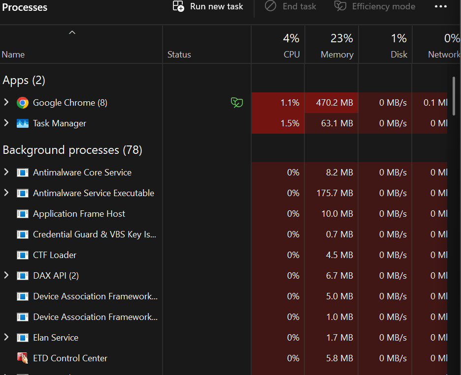
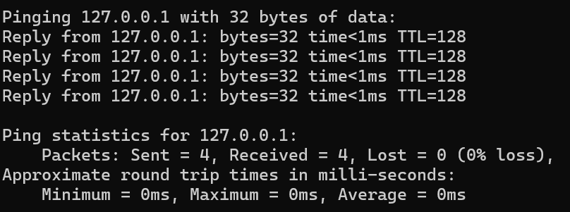
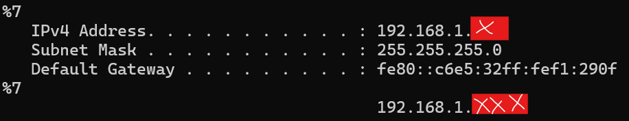
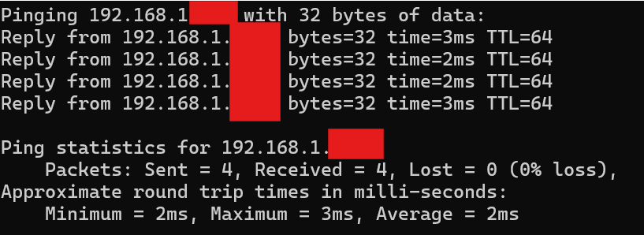
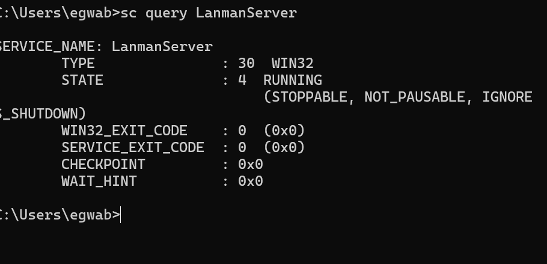
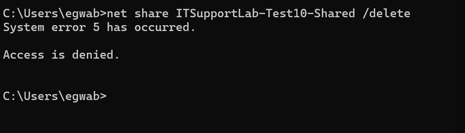
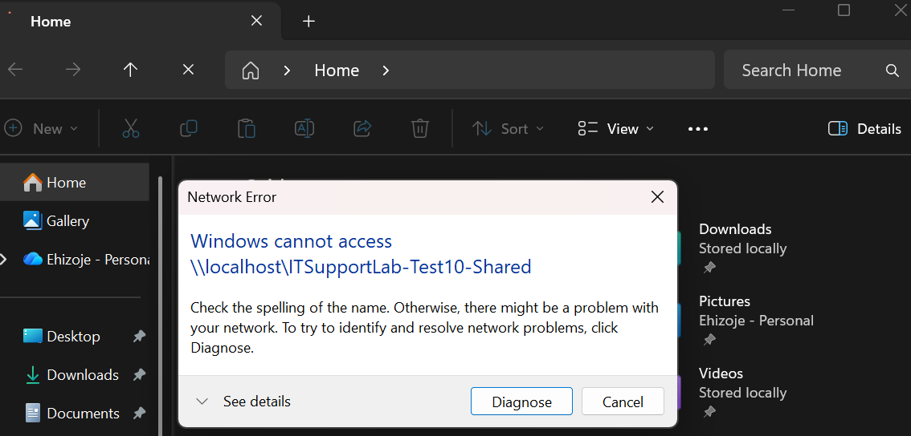
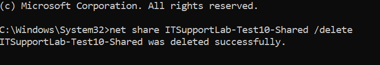
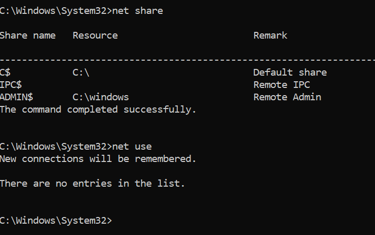
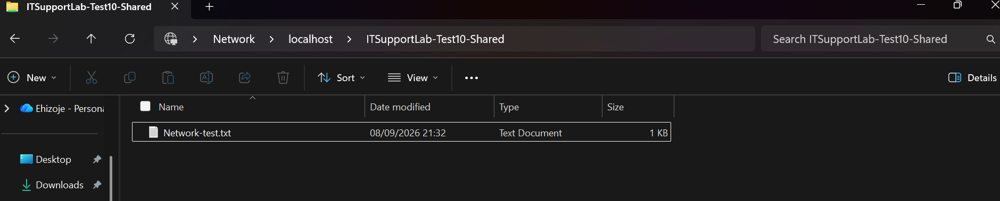

# Test 10 — Full IT Support Troubleshooting Scenario

## Overview

For this test I wanted to practise a more complete IT support scenario rather than focusing on just one Windows feature.

I simulated a user reporting three different problems at the same time:

- Their computer had become slow.
- Google Chrome was freezing.
- They could not access a shared network folder.

The aim was to approach this like I was dealing with a real help desk ticket. I started by asking questions about what the user was experiencing. I then worked through the possible causes one at a time instead of immediately changing things on the computer.

I also created my own controlled network-share problem. This allowed me to reproduce the issue properly and then investigate what was causing it. Once I had identified the cause I restored the share and checked that everything was working again.

---

## 1. Initial User Report

The simulated user reported:

> "My computer has become really slow today. Chrome keeps freezing, and I can't access the shared network folder I normally use."

Before making any changes I treated this like an actual support ticket and asked questions to get a better understanding of what was happening.

I first asked how many applications and browser tabs were open. The user said they had Google Chrome open with 8 tabs. File Explorer and Spotify were also running in the background.

I then asked how long the Chrome tabs had been open and whether they were all being used. The user explained that most of them had been open for around 2–3 hours but only around 3 of the 8 tabs were being actively used.

I also asked when the shared folder had last worked. The user said they had last used it around 3 hours earlier.

Because this was a shared folder I wanted to avoid assuming that nobody else had interacted with it. I asked whether another user could have accessed or changed anything in the folder while they were away. The user had not checked the folder history so I kept this as a possibility rather than ruling it out.

I also established that the user had Read and Write access. Other users could potentially have files open or locked.

When I asked what happened when they tried to open the folder the user explained that File Explorer would simply keep loading. There was no Access Denied message and no obvious error being displayed.

Getting this information first gave me a much clearer starting point. It also meant I could investigate the different symptoms separately rather than treating everything as one problem.

---

## 2. Initial Performance Investigation

I started with the performance issue because the user said the whole computer had become slow.

I opened Task Manager and checked the overall system resource usage.

At the time of the investigation the system showed:

- CPU: 4%
- Memory: 23%
- Disk: 1%
- Network: 0%

Google Chrome was using around 470 MB of memory and around 1.1% CPU at the time.

The Antimalware Service Executable was also not showing significant CPU usage.



### Finding

There was no obvious CPU, memory or disk bottleneck when I checked the computer.

This was important because I did not want to assume that the computer was slow because of high resource usage. The figures were fairly low at the time of testing.

I therefore decided not to start ending processes or closing applications just to see if it helped. I wanted to keep the troubleshooting controlled and investigate the reported symptoms properly.

---

## 3. Testing the Chrome Problem

The next part I looked at was the Chrome freezing issue.

I tried to reproduce the problem using the browser tabs that were already open. I interacted with the tabs normally and tested the ones the user said they were actively using.

Chrome continued working normally and I could not reproduce the freezing.

During the test Chrome was using around 975 MB of memory and 0% CPU at the time shown in Task Manager. The overall system was still only using around 25% memory with CPU at 4% and disk at 1%.

This was useful because it showed that Chrome was using some memory but it was not causing an obvious performance problem at that moment.

I decided not to uninstall Chrome or reset its settings. There was no evidence at that point that Chrome itself was currently malfunctioning. If this were a real support ticket I would keep the failed reproduction in the notes and investigate further if the user experienced the issue again.

---

## 4. Checking the Local Network Configuration

I then moved on to the network side of the problem.

Since the user could not access a shared network folder I wanted to make sure there was not a more general network problem first.

I started by testing the computer's local TCP/IP stack using:

```text
ping 127.0.0.1
```

The result was:

- 4 packets sent
- 4 packets received
- 0% packet loss
- Average response time: 0 ms



The localhost test was successful. This showed that the computer was able to respond to its own local network request.

It did not prove that the shared folder itself was working but it gave me a useful first check of the local networking stack.

---

## 5. Checking IP Configuration

I then used:

```text
ipconfig
```

to inspect the computer's network configuration.

The computer had:

- An IPv4 address on the local `192.168.1.X` network
- Subnet mask `255.255.255.0`
- A configured default gateway

I redacted the private IP information in the screenshot because this project is being documented on a public GitHub repository.



The configuration looked normal enough to continue with the connectivity tests.

This was another example of why I wanted to work through the problem step by step. There was no reason to start changing network settings when the existing configuration already looked valid.

---

## 6. Testing the Default Gateway

I then tested communication between the computer and its local gateway using:

```text
ping <default-gateway>
```

The test was successful:

- 4 packets sent
- 4 packets received
- 0% packet loss
- Minimum: 2 ms
- Maximum: 3 ms
- Average: 2 ms



The successful gateway test showed that the computer could communicate with the local network gateway.

Along with the successful localhost test and the user's report that their internet connection was working normally this gave me no immediate reason to believe that the whole network connection was down.

At this point I could focus more specifically on the shared folder rather than troubleshooting the internet connection.

---

## 7. Creating a Controlled Network Share

I did not have access to a company file server for this lab so I created a controlled test environment on my own computer.

I created a folder called:

```text
ITSupportLab-Test10-Shared
```

I then configured it as a Windows network share.

Inside the folder I created a test file called:

```text
Network-Test.txt
```

I was able to access the folder using:

```text
\\localhost\ITSupportLab-Test10-Shared
```

I also tested the share through Command Prompt using:

```text
net use \\localhost\ITSupportLab-Test10-Shared
```

Windows reported:

> The command completed successfully.

I then checked the current network connections with:

```text
net use
```

The share appeared with an `OK` status.



This gave me a working baseline before I introduced the fault.

I wanted to make sure the share actually worked first. Otherwise I would not be able to tell whether a later failure was caused by the fault I introduced or whether the share had never worked in the first place.

---

## 8. Introducing a Controlled Fault

Once I had a working network share I deliberately removed the share configuration while leaving the actual folder on the computer.

I initially attempted to remove the share using:

```text
net share ITSupportLab-Test10-Shared /delete
```

Windows returned:

```text
System error 5 has occurred.

Access is denied.
```



This happened because the Command Prompt I was using did not have the required administrative privileges.

This was actually useful for the lab because it gave me another realistic support situation to investigate. A command can be correct but still fail if the user does not have enough permission to perform the action.

I then opened Command Prompt with administrator privileges and ran the same command again.

This time Windows confirmed that:

```text
ITSupportLab-Test10-Shared was deleted successfully.
```

The share configuration had now been removed successfully.

---

## 9. Reproducing the Network Share Failure

After removing the share I tried to access the same network path again:

```text
\\localhost\ITSupportLab-Test10-Shared
```

Windows returned a Network Error stating:

> Windows cannot access `\\localhost\ITSupportLab-Test10-Shared`



This successfully reproduced the type of access problem described by the simulated user.

The important part here was that the physical folder still existed on the computer. I had not deleted the folder or the test file.

The problem was specifically that the folder was no longer configured as a network share.

That gave me a much stronger lead than simply seeing a network error and guessing what had happened.

---

## 10. Diagnosing the Cause

I used the following command to check which network shares were currently configured:

```text
net share
```

The test share `ITSupportLab-Test10-Shared` was no longer listed.

Only the existing Windows administrative shares were shown such as:

```text
C$
IPC$
ADMIN$
```



I also checked the current network connections using:

```text
net use
```

Windows reported:

```text
There are no entries in the list.
```

This confirmed that there was no existing network connection to the old share.

### Diagnosis

Based on the tests I identified the cause of the simulated network-folder failure as:

> **The shared folder could not be accessed because its network share configuration had been removed.**

I was able to confirm this rather than just assuming it. I had a working share at the start of the test. I deliberately removed the share and reproduced the error. I then used `net share` to confirm that the share was no longer configured.

This was the main part of the troubleshooting process because I had enough evidence to move from investigation to fixing the problem.

---

## 11. Applying the Fix

Once I knew what was wrong I restored the network share.

Before recreating it I checked the actual location of the folder because my first path assumption was incorrect.

The folder was actually stored inside the OneDrive Desktop location rather than directly under the normal local Desktop path.

The correct location was:

```text
C:\Users\<username>\OneDrive\Desktop\ITSupportLab-Test10-Shared
```

I then recreated the share from an Administrator Command Prompt using the correct folder path.

The command completed successfully and the network share was restored.

I used:

```text
net share
```

again to check that `ITSupportLab-Test10-Shared` had been added back to the list of available shares.



I also made sure not to publish my real Windows username in the GitHub documentation. I have replaced it with `<username>` here because the repository is public.

---

## 12. Final Verification

After restoring the share I opened the network path again:

```text
\\localhost\ITSupportLab-Test10-Shared
```

The folder opened successfully.

The original test file was still present:

```text
Network-Test.txt
```



This confirmed that the underlying folder and its contents had not been deleted.

The actual problem had been with the network-sharing configuration. Once the share was recreated the folder could be accessed again.

I also verified that the test file was still accessible through the restored network share. This gave me a clear before-and-after result and showed that the fix had actually worked.

---

# Troubleshooting Process

The overall process I followed was:

```text
User reports problem
        ↓
Ask questions and gather information
        ↓
Check Task Manager
        ↓
Test Chrome
        ↓
Check IP configuration
        ↓
Ping localhost
        ↓
Ping default gateway
        ↓
Establish a working network-share baseline
        ↓
Introduce a controlled fault
        ↓
Reproduce the network-share error
        ↓
Check configured network shares
        ↓
Identify missing share
        ↓
Restore the share
        ↓
Verify access and file availability
```

I liked this test because it felt closer to how I would expect a real help desk issue to work. I did not immediately jump to one answer. I started with the user's description and then used the available evidence to narrow the problem down.

---

# Final Outcome

The simulated network-folder issue was successfully diagnosed and resolved.

The computer did not show an obvious performance bottleneck during testing. The Chrome freezing problem also could not be reproduced at the time of the investigation.

The network tests showed that the local TCP/IP stack was working and that the computer could communicate successfully with the network gateway.

The network-share problem was then successfully reproduced by removing the share configuration. I confirmed that the share was missing by using `net share`.

After recreating the share with the correct folder path I was able to access the network folder again. The `Network-Test.txt` file was still there and could be accessed normally.

This gave me a complete troubleshooting cycle from the initial user report through to final verification.

---

# What I Practised

This test gave me practice with a much more complete IT support workflow rather than just checking individual Windows settings.

I practised:

- Gathering information from a user before making changes
- Asking questions to narrow down a technical problem
- Checking system performance with Task Manager
- Testing whether a reported application problem could be reproduced
- Checking Windows IP configuration
- Testing local TCP/IP connectivity
- Testing communication with the network gateway
- Creating and testing a Windows network share
- Using `net use` to investigate network connections
- Using `net share` to inspect configured shares
- Understanding administrative permissions when using Command Prompt
- Recognising and investigating System Error 5
- Reproducing a network-share failure in a controlled environment
- Understanding the difference between a local folder and a network share
- Restoring a missing network share
- Verifying that the fix actually worked
- Keeping evidence throughout the troubleshooting process
- Avoiding unnecessary changes when a problem cannot be reproduced

---

# Main Takeaway

One of the biggest things I took from this test was that troubleshooting should be based on evidence rather than assumptions.

The user reported that their computer was slow and that Chrome was freezing. When I checked the computer there was no obvious resource problem and I could not reproduce the Chrome issue.

Instead of making unnecessary changes I continued investigating the network-share problem. I was able to reproduce that issue in a controlled way and then use Windows tools to find out what had actually happened.

The System Error 5 was also a good reminder that some troubleshooting actions require administrator privileges. The error did not mean that the command itself was wrong. It meant that I was not running it with enough permission.

Overall this helped me practise approaching a support problem more like a real ticket:

**Understand the issue → investigate it → reproduce it where possible → identify the cause → make a controlled change → verify the result.**

---

## Evidence

### 1. Task Manager Performance
[View Screenshot](01-task-manager-performance.png)

### 2. Ping Localhost
[View Screenshot](02-ping-localhost.png)

### 3. IP Configuration
[View Screenshot](03-ipconfig-network-config.png)

### 4. Ping Default Gateway
[View Screenshot](04-ping-gateway.png)

### 5. Network Share Connection
[View Screenshot](05-network-share-connection.png)

### 6. Network Share Error
[View Screenshot](06-network-share-error.png)

### 7. Network Share Diagnosis
[View Screenshot](07-network-share-diagnosis.png)

### 8. Network Share Restored Using Command Prompt
[View Screenshot](08-network-share-restored-command.png)

### 9. Network Share Successfully Restored
[View Screenshot](09-network-share-restored.png)

### 10. Permission Error
[View Screenshot](10-permission-error.png)

---

## References

- [Microsoft Support — Windows networking and file sharing](https://support.microsoft.com/windows)
- [Microsoft Learn — Windows networking](https://learn.microsoft.com/en-us/windows-server/networking/)
